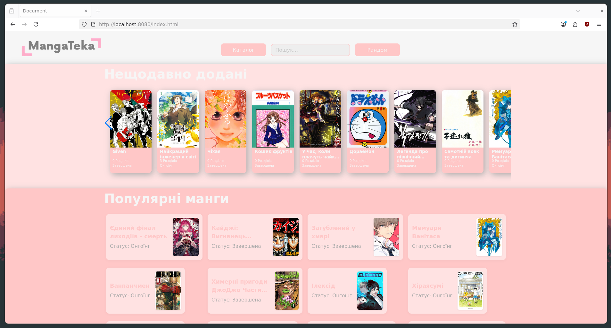
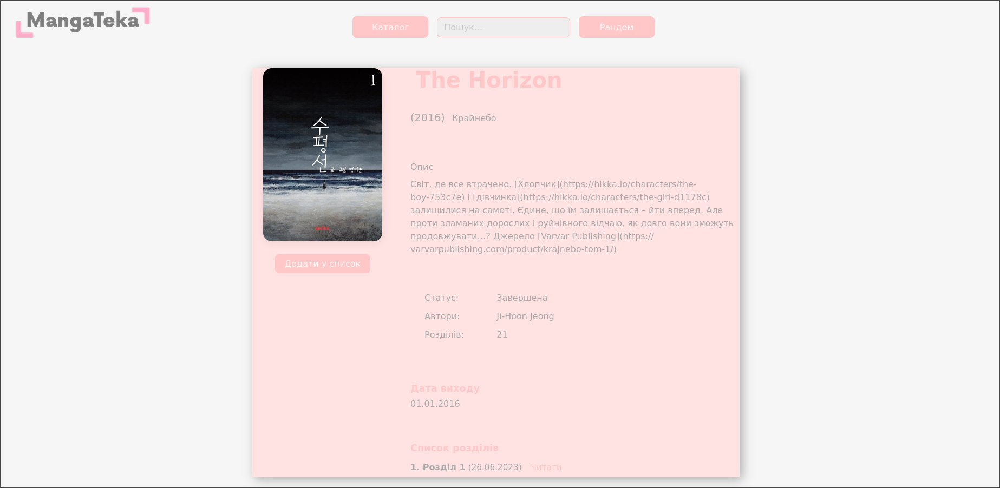
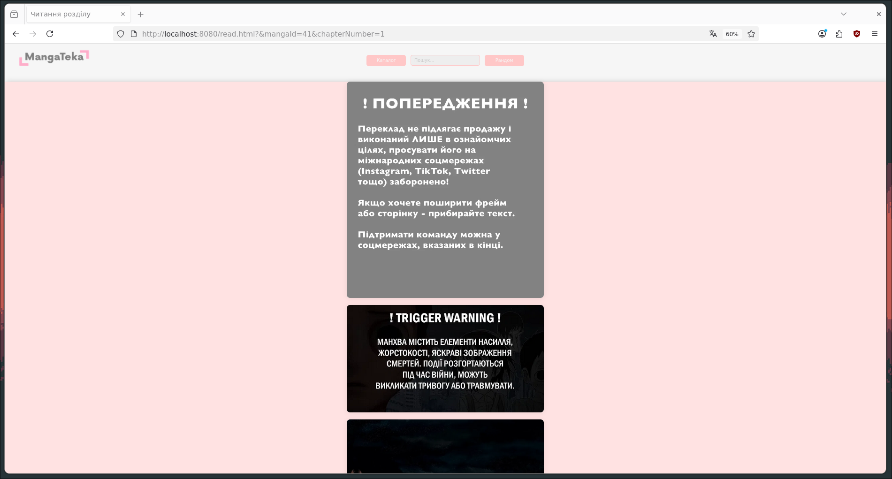
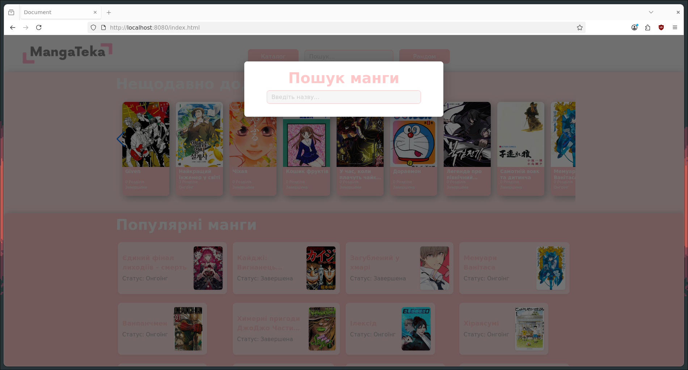

## Development: Build and Run with Docker Compose

To build and run the developer version of this project, follow these steps:

1. **Install Docker and Docker Compose**
   - Make sure Docker and Docker Compose are installed on your system.

2. **Clone the repository**
   - `git clone <repo-url>`
   - `cd library-manga`

3. **Build and start all services**
   - Run the following command in the project root:
     ```bash
     docker-compose up --build
     ```
   - This will build and start the backend API, frontend, and PostgreSQL database containers.

4. **Access the application**
   - Frontend: http://localhost:8080
   - Backend API: http://localhost:5000

5. **Stop the application**
   - Press `Ctrl+C` in the terminal, then run:
     ```bash
     docker-compose down
     ```

This setup is intended for local development and testing. All code changes in the `front` directory will be reflected automatically in the running frontend container.
# Library Manga

This project is a practical assignment for university, designed to demonstrate modern web development practices using a full-stack architecture.

## Overview

The application consists of:

- **Frontend**: Developed in TypeScript, providing a user interface for browsing manga titles and interacting with the API.
- **Backend**: Built with C# as a RESTful API, handling business logic and data access.
- **Database**: Uses PostgreSQL to store manga, authors, chapters, ratings, and other related data.
- **Docker**: All components (frontend, backend, and database) are containerized using Docker, making it easy to run and deploy the application in any environment.

## Features

- Random, popular, and latest manga queries via API
- Separation of concerns between frontend and backend
- Easy local development with Docker Compose

## How it works

1. The backend API exposes endpoints for manga data, connected to a PostgreSQL database.
2. The frontend, written in TypeScript, fetches data from the API and displays it to users.
3. Docker Compose orchestrates the containers, ensuring all services run together seamlessly.

This structure allows students to learn and practice real-world web development, API design, database integration, and containerization.

---

## Example Screenshots

Below are some example screenshots of the Library Manga site:

### Main Page



### Catalog


### Manga Details



### Reader



### Search



---

## Demo Video

Watch a short demo of the application in action:

<video src=".assets/ss_video.mp4" controls width="700">
  Your browser does not support the video tag.
</video>


